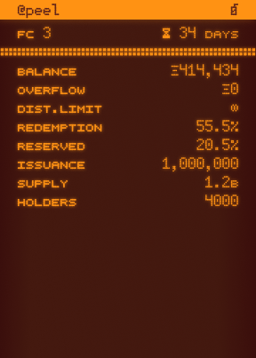

# Onchain SVG Resolver

## Running tests

`forge test --fork-url $ETH_RPC_URL -v --via-ir --ffi --fork-block-number BLOCK_NUMBER --match-test Get`

Replace `$ETH_RPC_URL` and `BLOCK_NUMBER` with your preferred values.

## Demo

useful byte length checker https://mothereff.in/byte-counter